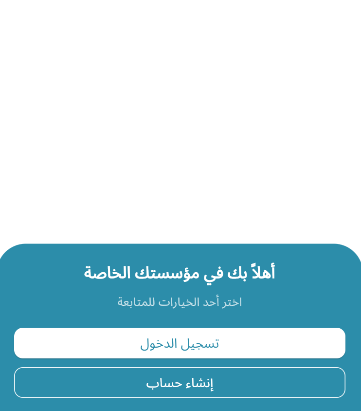
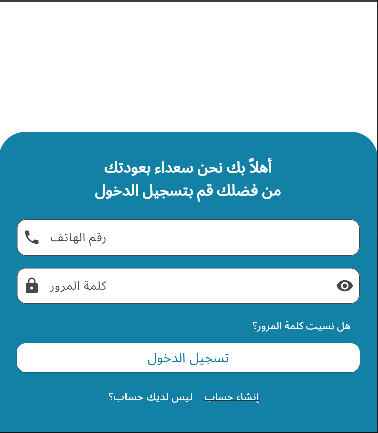
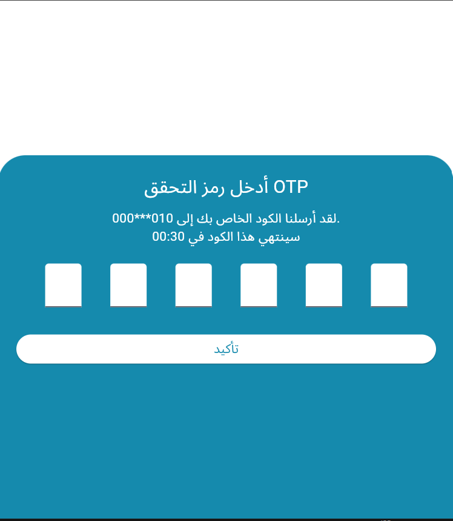
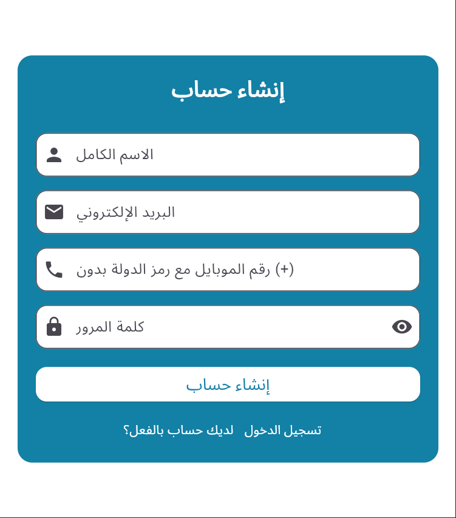
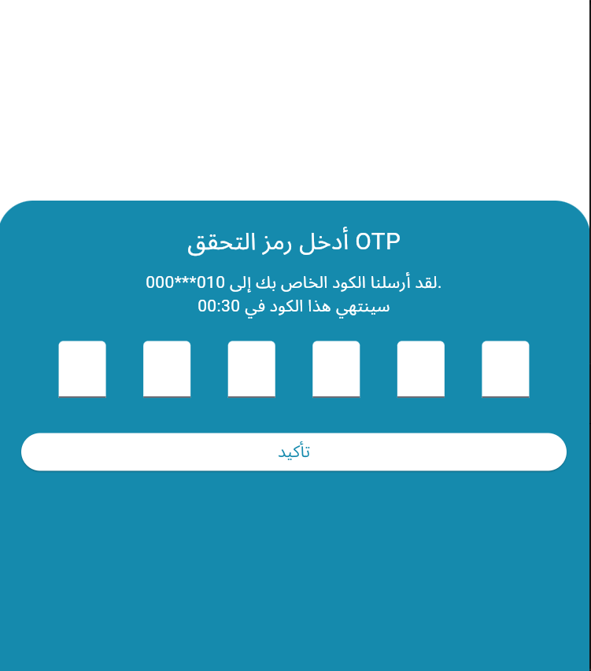

 Flutter Login & Signup UI
A simple login & signup system built with Flutter, allowing users to register, log in, and verify their account via an OTP screen. The app provides a welcoming experience in Arabic, support a modern UI design.
________________________________________
📋 Project Idea
•	Welcome Screen: User chooses whether to log in or create a new account.
•	Login Screen: User enters their phone number and password to log in.
•	Signup Screen: User registers with name, email, phone, and password.
•	OTP Screen: After login or signup, user enters the 6-digit OTP code to verify.
________________________________________
👨‍💻 Concepts & Technologies Used
✨ Flutter & Dart for cross-platform mobile development.
✨ Stateful & Stateless Widgets to manage dynamic and static parts of the UI.
✨ Form Validation using Form and TextFormField.
✨ Navigation with Navigator.push & Navigator.pop.
✨ TextEditingController to control and validate text inputs.
✨ Custom Colors defined in a separate AppColors class for consistency.
________________________________________
🧾 Main Screens & Files
Screen/File	🔷 Description
main.dart	Entry point of the app. Loads WelcomeScreen.
welcome_screen.dart	Lets the user choose between Login or Signup.
login_screen.dart	Login form with validation and password visibility toggle.
signup_screen.dart	Signup form with validation for all fields.
otp_screen.dart	OTP verification screen with 6-digit code input.
app_colors.dart	Defines a color palette used throughout the app.
________________________________________
 How it Works
1️⃣ Run the app.
2️⃣ Welcome screen appears → choose Login or Signup.
3️⃣ - If Login → enter phone and password → navigate to OTP screen.
•	If Signup → enter name, email, phone, and password → navigate to OTP screen.
4️⃣ On OTP screen → enter the 6-digit verification code.
________________________________________

 
 

